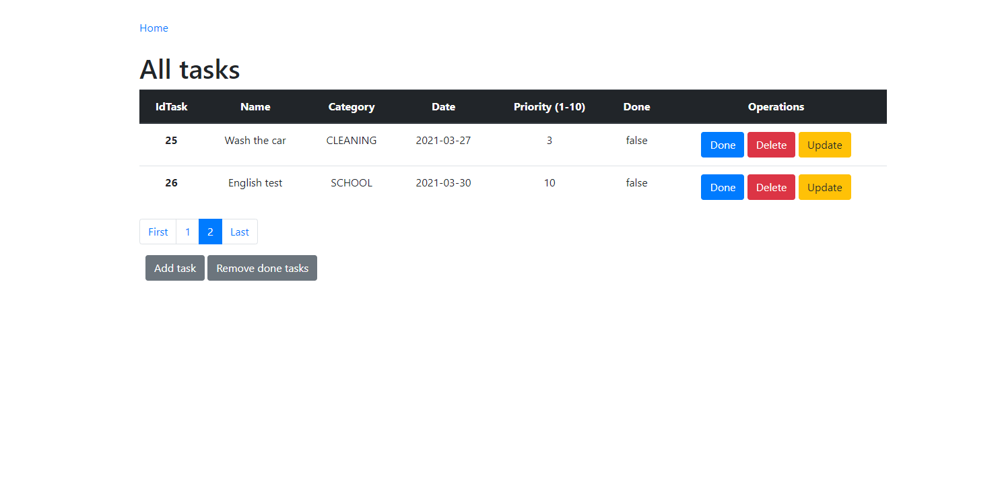

# toDoSpringBoot
## To Do App (Spring Boot, Thymleaf, JPA, Hibernate)
### The application allows CRUD you tasks

**All tasks** - table has pageable

**Add form task**

**Update form task**

**Task can have two form:**
1. Open - not done
2. Done

**Delete task**

**Delete all done tasks**

